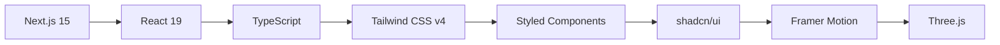
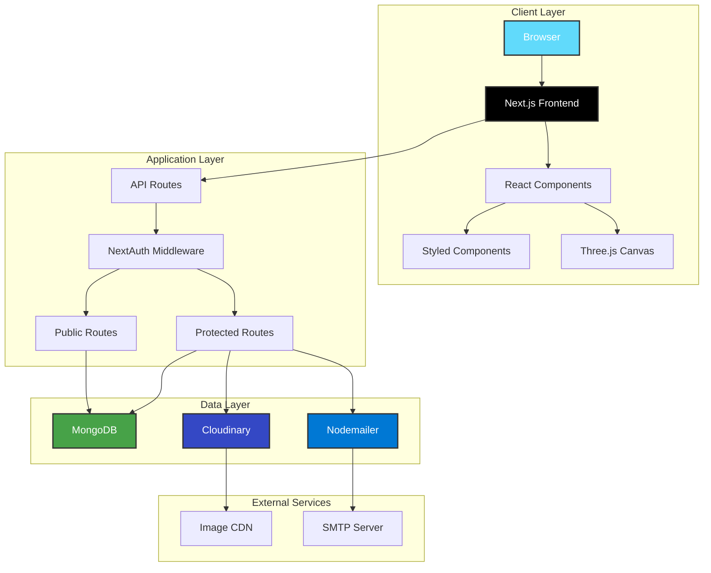
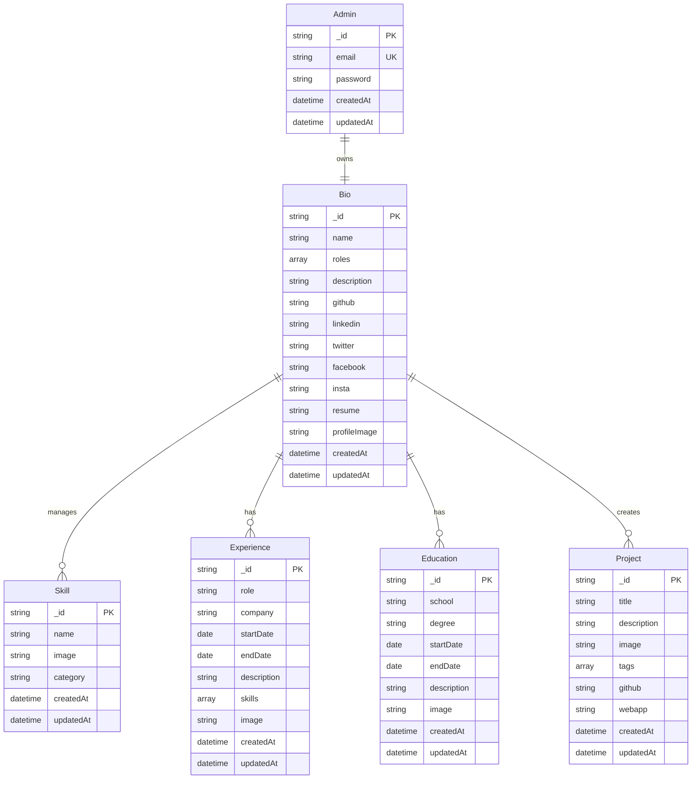
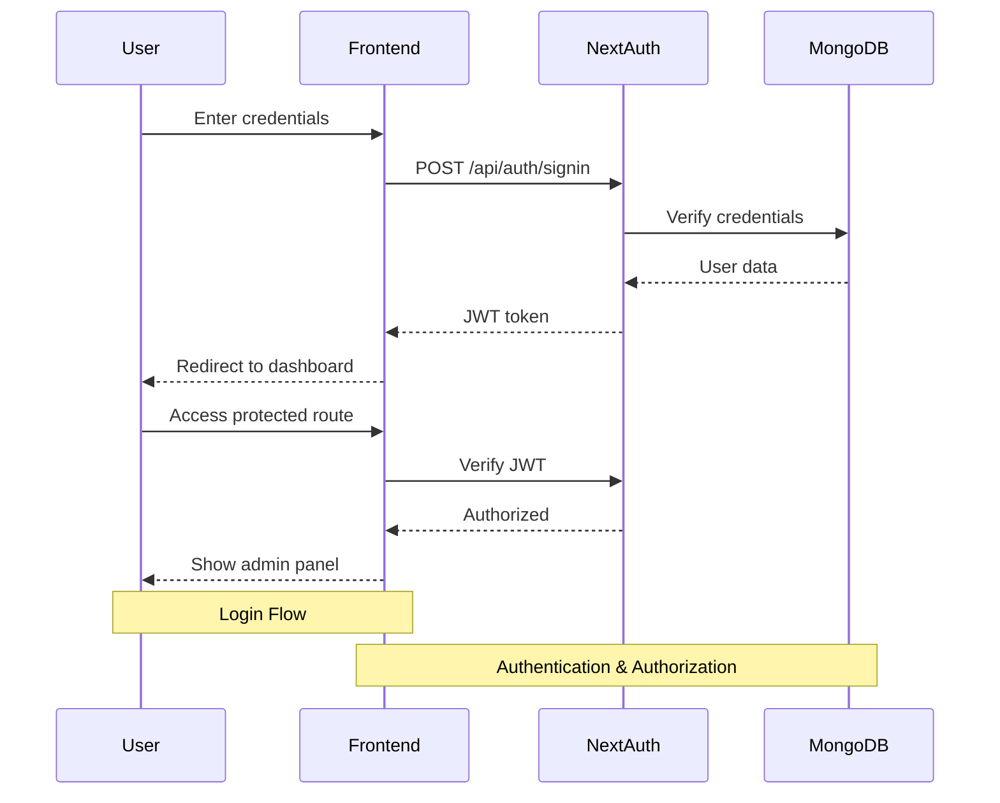
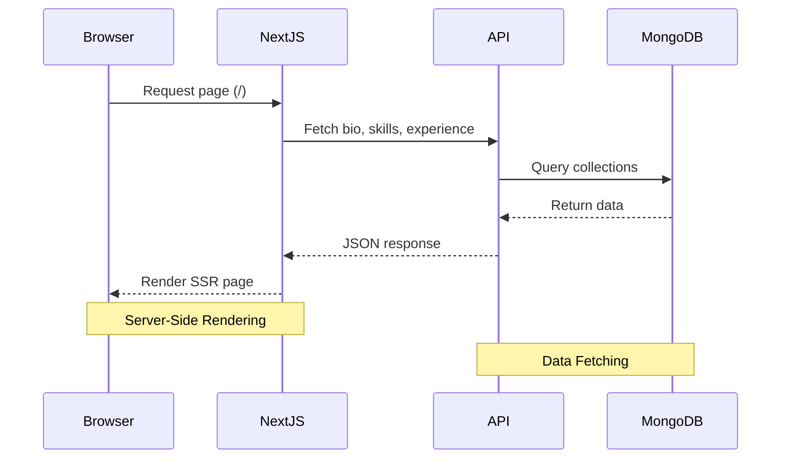
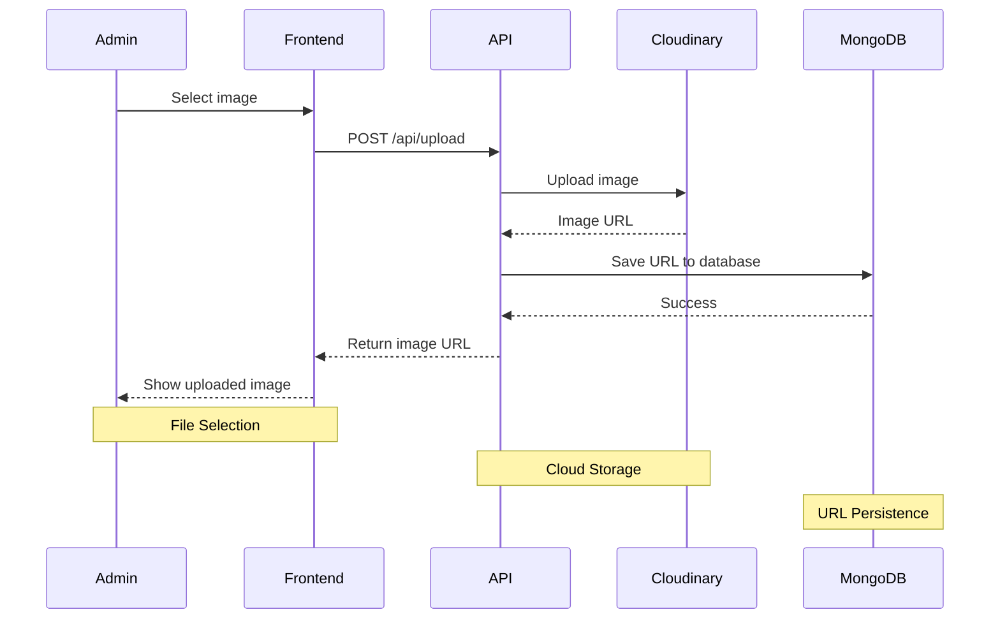
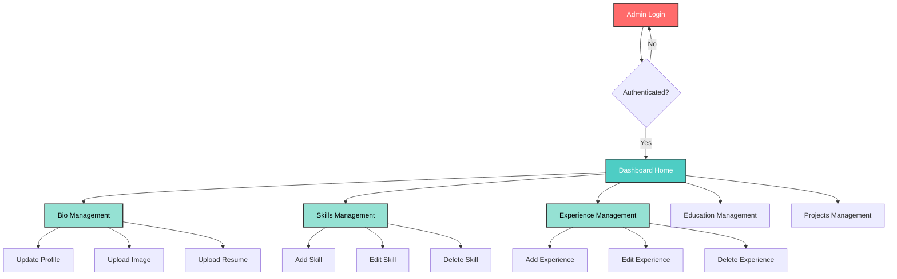

# 🎨 Dynamic Portfolio - Next.js 15

<div align="center">


**A modern, fully customizable portfolio website with an admin dashboard for dynamic content management**

[Live Demo](#) • [Documentation](#features) • [Setup Guide](#getting-started)

</div>

---

## 📋 Table of Contents

- [Overview](#-overview)
- [Features](#-features)
- [Tech Stack](#-tech-stack)
- [System Architecture](#-system-architecture)
- [Database Schema](#-database-schema)
- [Getting Started](#-getting-started)
- [Project Structure](#-project-structure)
- [API Documentation](#-api-documentation)
- [Admin Dashboard](#-admin-dashboard)
- [Performance Optimizations](#-performance-optimizations)
- [Deployment](#-deployment)
- [License](#-license)

---

## 🌟 Overview

This is a **production-ready portfolio website** built with the latest web technologies. Unlike static portfolios, this project features a **full-stack admin dashboard** that allows you to manage all content dynamically without touching code.

### Key Highlights

- ✅ **100% Dynamic Content** - Update everything through admin panel
- ✅ **Modern UI/UX** - Beautiful animations and responsive design
- ✅ **SEO Optimized** - Server-side rendering with metadata
- ✅ **Production Ready** - Optimized for performance and scalability
- ✅ **Type Safe** - Built with TypeScript
- ✅ **Cloud Ready** - Integrated with Cloudinary for image management

---

## ✨ Features

### 🎯 Frontend Features

| Feature                | Description                               | Technology                |
| ---------------------- | ----------------------------------------- | ------------------------- |
| **3D Animations**      | Interactive star background with Three.js | `@react-three/fiber`      |
| **Smooth Transitions** | Page and scroll animations                | `framer-motion`           |
| **Dark/Light Theme**   | Persistent theme switching                | `next-themes`             |
| **Responsive Design**  | Mobile-first approach                     | `Tailwind CSS v4`         |
| **Contact Form**       | Email integration with validation         | `react-hook-form` + `zod` |
| **SEO Optimization**   | Meta tags, sitemap, structured data       | Next.js 15                |

### 🔐 Admin Dashboard Features

| Feature                   | Description                                   |
| ------------------------- | --------------------------------------------- |
| **Bio Management**        | Update name, roles, description, social links |
| **Skills Management**     | Add/Edit/Delete skills with categories        |
| **Experience Management** | Manage work experience with timeline          |
| **Education Management**  | Add education history                         |
| **Projects Management**   | Showcase projects with images and links       |
| **Image Upload**          | Direct upload to Cloudinary                   |
| **Resume Upload**         | PDF resume management                         |
| **Real-time Preview**     | See changes instantly                         |

### 📧 Additional Features

- **Email Notifications** - Contact form submissions via Nodemailer
- **Authentication** - Secure admin access with NextAuth.js
- **Database** - MongoDB with Mongoose ODM
- **Validation** - Zod schema validation
- **Error Handling** - Comprehensive error handling

---

## 🛠️ Tech Stack

### Frontend Stack



| Category       | Technologies                       |
| -------------- | ---------------------------------- |
| **Framework**  | Next.js 15 (App Router)            |
| **UI Library** | React 19                           |
| **Language**   | TypeScript, JavaScript             |
| **Styling**    | Tailwind CSS v4, Styled Components |
| **Components** | shadcn/ui, Radix UI                |
| **Animations** | Framer Motion, Three.js            |
| **Forms**      | React Hook Form, Zod               |
| **Icons**      | Lucide React, React Icons          |

### Backend Stack

| Category           | Technologies       |
| ------------------ | ------------------ |
| **Database**       | MongoDB, Mongoose  |
| **Authentication** | NextAuth.js v4     |
| **Image Storage**  | Cloudinary         |
| **Email Service**  | Nodemailer         |
| **Validation**     | Zod                |
| **Security**       | bcrypt, jose (JWT) |

### Development Tools

| Tool                | Purpose                   |
| ------------------- | ------------------------- |
| **pnpm**            | Package manager           |
| **ESLint**          | Code linting              |
| **Turbopack**       | Fast bundler (Next.js 15) |
| **Bundle Analyzer** | Bundle size analysis      |

---

## 🏗️ System Architecture



### Architecture Flow

1. **Client Layer**: User interacts with Next.js frontend
2. **Application Layer**: API routes handle business logic
3. **Authentication**: NextAuth.js protects admin routes
4. **Data Layer**: MongoDB stores data, Cloudinary stores images
5. **External Services**: Email notifications via SMTP

---

## 🗄️ Database Schema



### Database Models

| Model          | Fields                                         | Purpose              |
| -------------- | ---------------------------------------------- | -------------------- |
| **Bio**        | name, roles, description, social links, images | Personal information |
| **Skill**      | name, image, category                          | Technical skills     |
| **Experience** | role, company, dates, description, skills      | Work history         |
| **Education**  | school, degree, dates, description             | Education history    |
| **Project**    | title, description, image, tags, links         | Portfolio projects   |
| **Admin**      | email, password                                | Admin authentication |

---

## 🚀 Getting Started

### Prerequisites

Before you begin, ensure you have:

- ✅ **Node.js 18+** installed ([Download](https://nodejs.org/))
- ✅ **MongoDB** database ([MongoDB Atlas](https://www.mongodb.com/cloud/atlas) - Free tier available)
- ✅ **Cloudinary** account ([Sign up](https://cloudinary.com/))
- ✅ **Email SMTP** credentials (Gmail recommended)

### Installation Steps

#### 1️⃣ Clone the Repository

```bash
git clone <your-repo-url>
cd ProtfolioNext
```

#### 2️⃣ Install Dependencies

Using **pnpm** (recommended):

```bash
pnpm install
```

Or using **npm**:

```bash
npm install
```

#### 3️⃣ Environment Setup

Copy the example environment file:

```bash
# Windows
copy .env.example .env.local

# Linux/Mac
cp .env.example .env.local
```

Edit `.env.local` with your credentials:

```env
# MongoDB Connection
MONGODB_URI=

# NextAuth Configuration
NEXTAUTH_URL=
NEXTAUTH_SECRET=

# Cloudinary Configuration
NEXT_PUBLIC_CLOUDINARY_CLOUD_NAME=
CLOUDINARY_API_KEY=
CLOUDINARY_API_SECRET=

# Email Configuration (Gmail Example)
EMAIL_HOST=
EMAIL_PORT=
EMAIL_USER=
EMAIL_PASSWORD=
EMAIL_FROM=
EMAIL_TO=

# Admin Credentials
ADMIN_EMAIL=
ADMIN_PASSWORD=
```

> [!TIP] > **Generate NEXTAUTH_SECRET**: Run `openssl rand -base64 32` in terminal

> [!WARNING] > **Gmail Users**: Enable 2FA and create an [App Password](https://support.google.com/accounts/answer/185833)

#### 4️⃣ Seed the Database (Optional)

Populate your database with initial data:

```bash
pnpm run seed
```

This will create:

- ✅ Admin user
- ✅ Sample bio data
- ✅ Sample skills
- ✅ Sample experience
- ✅ Sample education
- ✅ Sample projects

#### 5️⃣ Run Development Server

```bash
pnpm run dev
```

Open your browser:

- 🌐 **Frontend**: [http://localhost:3000](http://localhost:3000)
- 🔐 **Admin Login**: [http://localhost:3000/admin/login](http://localhost:3000/admin/login)

---

## 📁 Project Structure

```
ProtfolioNext/
├── 📂 app/                          # Next.js App Router
│   ├── 📂 api/                      # API Routes
│   │   ├── 📂 bio/                  # Bio CRUD operations
│   │   ├── 📂 skills/               # Skills CRUD
│   │   ├── 📂 experience/           # Experience CRUD
│   │   ├── 📂 education/            # Education CRUD
│   │   ├── 📂 projects/             # Projects CRUD
│   │   ├── 📂 upload/               # Image upload
│   │   ├── 📂 contact/              # Contact form
│   │   └── 📂 admin/                # Admin-specific APIs
│   ├── 📂 admin/                    # Admin Dashboard
│   │   ├── 📂 bio/                  # Bio management page
│   │   ├── 📂 skills/               # Skills management
│   │   ├── 📂 experience/           # Experience management
│   │   ├── 📂 education/            # Education management
│   │   ├── 📂 projects/             # Projects management
│   │   ├── 📂 login/                # Admin login
│   │   ├── layout.jsx               # Admin layout
│   │   └── page.jsx                 # Admin dashboard
│   ├── layout.jsx                   # Root layout
│   ├── page.jsx                     # Homepage
│   ├── globals.css                  # Global styles
│   ├── manifest.js                  # PWA manifest
│   └── sitemap.js                   # SEO sitemap
├── 📂 components/                   # React Components
│   ├── 📂 canvas/                   # Three.js components
│   │   ├── Stars.jsx                # Star background
│   │   └── StarsWrapper.jsx         # Lazy loader
│   ├── 📂 cards/                    # Card components
│   │   ├── ExperienceCard.jsx       # Experience timeline card
│   │   ├── EducationCard.jsx        # Education card
│   │   └── ProjectCard.jsx          # Project showcase card
│   ├── 📂 sections/                 # Page sections
│   │   ├── Hero.jsx                 # Hero section
│   │   ├── Skills.jsx               # Skills section
│   │   ├── Experience.jsx           # Experience timeline
│   │   ├── Education.jsx            # Education section
│   │   ├── Projects.jsx             # Projects showcase
│   │   ├── Contact.jsx              # Contact form
│   │   └── Footer.jsx               # Footer
│   ├── 📂 admin/                    # Admin components
│   │   ├── AdminHeader.jsx          # Admin header
│   │   └── AdminSidebar.jsx         # Admin sidebar
│   ├── 📂 HeroBgAnimation/          # Hero background
│   ├── Navbar.jsx                   # Navigation bar
│   ├── AnimatedSection.jsx          # Scroll animations
│   ├── PageLoader.jsx               # Page loader
│   ├── ScrollProgress.jsx           # Scroll indicator
│   ├── ThemeToggle.jsx              # Theme switcher
│   └── StructuredData.jsx           # SEO structured data
├── 📂 lib/                          # Utilities & Config
│   ├── 📂 db/                       # Database
│   │   ├── 📂 models/               # Mongoose models
│   │   │   ├── Admin.js             # Admin model
│   │   │   ├── Bio.js               # Bio model
│   │   │   ├── Skill.js             # Skill model
│   │   │   ├── Experience.js        # Experience model
│   │   │   ├── Education.js         # Education model
│   │   │   └── Project.js           # Project model
│   │   └── mongoose.js              # DB connection
│   ├── 📂 utils/                    # Utility functions
│   │   ├── motion.js                # Animation configs
│   │   └── schema.js                # Validation schemas
│   ├── auth.ts                      # NextAuth config
│   ├── cloudinary.js                # Cloudinary setup
│   ├── nodemailer.js                # Email setup
│   ├── registry.jsx                 # Styled components
│   └── utils.ts                     # Helper functions
├── 📂 hooks/                        # Custom React Hooks
│   └── useScrollAnimation.js        # Scroll animation hook
├── 📂 scripts/                      # Utility Scripts
│   └── seed.js                      # Database seeding
├── 📂 public/                       # Static Assets
│   ├── 📂 planet/                   # 3D assets
│   ├── robots.txt                   # SEO robots
│   └── [images]                     # Static images
├── 📄 .env.example                  # Environment template
├── 📄 .env.local                    # Environment variables (gitignored)
├── 📄 package.json                  # Dependencies
├── 📄 pnpm-lock.yaml                # Lock file
├── 📄 next.config.mjs               # Next.js config
├── 📄 tailwind.config.ts            # Tailwind config
├── 📄 tsconfig.json                 # TypeScript config
├── 📄 middleware.ts                 # NextAuth middleware
└── 📄 README.md                     # This file
```

---

## 📡 API Documentation

### Authentication Flow



### API Data Flow



### Image Upload Flow



### API Endpoints

#### 🌐 Public Endpoints

| Method | Endpoint          | Description        | Response                             |
| ------ | ----------------- | ------------------ | ------------------------------------ |
| `GET`  | `/api/bio`        | Get profile data   | `{ name, roles, description, ... }`  |
| `GET`  | `/api/skills`     | Get all skills     | `[{ name, image, category }, ...]`   |
| `GET`  | `/api/experience` | Get experiences    | `[{ role, company, ... }, ...]`      |
| `GET`  | `/api/education`  | Get education      | `[{ school, degree, ... }, ...]`     |
| `GET`  | `/api/projects`   | Get projects       | `[{ title, description, ... }, ...]` |
| `POST` | `/api/contact`    | Send contact email | `{ success: true }`                  |

#### 🔐 Protected Endpoints (Admin Only)

| Method   | Endpoint               | Description       | Auth Required |
| -------- | ---------------------- | ----------------- | ------------- |
| `PUT`    | `/api/bio`             | Update profile    | ✅            |
| `POST`   | `/api/skills`          | Create skill      | ✅            |
| `PUT`    | `/api/skills/[id]`     | Update skill      | ✅            |
| `DELETE` | `/api/skills/[id]`     | Delete skill      | ✅            |
| `POST`   | `/api/experience`      | Create experience | ✅            |
| `PUT`    | `/api/experience/[id]` | Update experience | ✅            |
| `DELETE` | `/api/experience/[id]` | Delete experience | ✅            |
| `POST`   | `/api/education`       | Create education  | ✅            |
| `PUT`    | `/api/education/[id]`  | Update education  | ✅            |
| `DELETE` | `/api/education/[id]`  | Delete education  | ✅            |
| `POST`   | `/api/projects`        | Create project    | ✅            |
| `PUT`    | `/api/projects/[id]`   | Update project    | ✅            |
| `DELETE` | `/api/projects/[id]`   | Delete project    | ✅            |
| `POST`   | `/api/upload`          | Upload image      | ✅            |
| `POST`   | `/api/admin/resume`    | Upload resume     | ✅            |
| `DELETE` | `/api/admin/resume`    | Delete resume     | ✅            |

### API Request/Response Examples

#### Get Bio Data

```bash
GET /api/bio
```

**Response:**

```json
{
  "_id": "...",
  "name": "Shanto Kumar",
  "roles": ["Front-End Developer", "Web Designer"],
  "description": "Passionate developer...",
  "github": "https://github.com/...",
  "linkedin": "https://linkedin.com/in/...",
  "profileImage": "https://res.cloudinary.com/...",
  "resume": "https://res.cloudinary.com/..."
}
```

#### Create Skill

```bash
POST /api/skills
Authorization: Bearer <token>
Content-Type: application/json

{
  "name": "React",
  "image": "https://...",
  "category": "Frontend"
}
```

**Response:**

```json
{
  "_id": "...",
  "name": "React",
  "image": "https://...",
  "category": "Frontend",
  "createdAt": "2024-01-01T00:00:00.000Z"
}
```

---

## 🎛️ Admin Dashboard

### Dashboard Overview



### Admin Features

#### 1. Bio Management

- ✏️ Update name, roles, description
- 🔗 Manage social media links
- 🖼️ Upload profile image
- 📄 Upload/delete resume PDF

#### 2. Skills Management

- ➕ Add new skills with categories
- 🖼️ Upload skill icons
- ✏️ Edit existing skills
- 🗑️ Delete skills

#### 3. Experience Management

- 📝 Add work experience
- 📅 Set start/end dates
- 🏷️ Tag relevant skills
- 🖼️ Upload company logos

#### 4. Education Management

- 🎓 Add education history
- 📅 Set dates
- 📝 Add descriptions
- 🖼️ Upload school logos

#### 5. Projects Management

- 🚀 Showcase projects
- 🖼️ Upload project images
- 🏷️ Add technology tags
- 🔗 Link to GitHub/Live demo

---

## ⚡ Performance Optimizations

### Implemented Optimizations

| Optimization               | Impact                   | Implementation                 |
| -------------------------- | ------------------------ | ------------------------------ |
| **Deferred Stars Loading** | LCP improved by 4s       | Lazy load Three.js after 1-2s  |
| **Reduced PageLoader**     | Faster perceived load    | 2000ms → 800ms                 |
| **GPU Acceleration**       | Smooth animations        | `will-change` CSS property     |
| **Optimized Animations**   | Less layout thrashing    | Reduced framer-motion duration |
| **Image Optimization**     | Faster image loads       | Cloudinary CDN                 |
| **Code Splitting**         | Smaller bundles          | Dynamic imports                |
| **SSR**                    | Better SEO & performance | Next.js 15                     |

### Performance Metrics

**Before Optimization:**

- LCP: ~6.5s
- PageLoader: 2000ms
- Forced Reflows: Yes (23ms+)

**After Optimization:**

- LCP: <2.5s ✅
- PageLoader: 800ms ✅
- Forced Reflows: None ✅

### Lighthouse Score

Target scores:

- 🟢 Performance: 90+
- 🟢 Accessibility: 95+
- 🟢 Best Practices: 95+
- 🟢 SEO: 100

---

## 🚀 Deployment

### Deploy to Vercel (Recommended)

[](https://vercel.com/new)

#### Steps:

1. **Push to GitHub**

   ```bash
   git init
   git add .
   git commit -m "Initial commit"
   git remote add origin <your-repo-url>
   git push -u origin main
   ```

2. **Import to Vercel**

   - Go to [vercel.com](https://vercel.com)
   - Click "New Project"
   - Import your GitHub repository

3. **Add Environment Variables**

   - Copy all variables from `.env.local`
   - Paste in Vercel project settings

4. **Deploy**
   - Click "Deploy"
   - Wait for build to complete
   - Your site is live! 🎉

### Deploy to Other Platforms

#### Netlify

```bash
npm run build
# Deploy the .next folder
```

#### Railway

```bash
# Add railway.json
{
  "build": {
    "builder": "NIXPACKS"
  },
  "deploy": {
    "startCommand": "npm start",
    "restartPolicyType": "ON_FAILURE"
  }
}
```

---

## 📜 Available Scripts

```bash
# Development
pnpm run dev          # Start dev server with Turbopack

# Production
pnpm run build        # Build for production
pnpm run start        # Start production server

# Database
pnpm run seed         # Seed database with initial data

# Code Quality
pnpm run lint         # Run ESLint

# Analysis
pnpm run analyze      # Analyze bundle size
```

---

## 🙏 Acknowledgments

- [Next.js](https://nextjs.org/) - The React Framework
- [shadcn/ui](https://ui.shadcn.com/) - Beautiful UI components
- [Framer Motion](https://www.framer.com/motion/) - Animation library
- [Three.js](https://threejs.org/) - 3D graphics
- [MongoDB](https://www.mongodb.com/) - Database
- [Cloudinary](https://cloudinary.com/) - Image CDN

---

## 📞 Support

For support, email shantokumar00@gmail.com or open an issue on GitHub.

---

<div align="center">

**Built with ❤️ using Next.js 15**

[⬆ Back to Top](#-dynamic-portfolio---nextjs-15)

</div>
