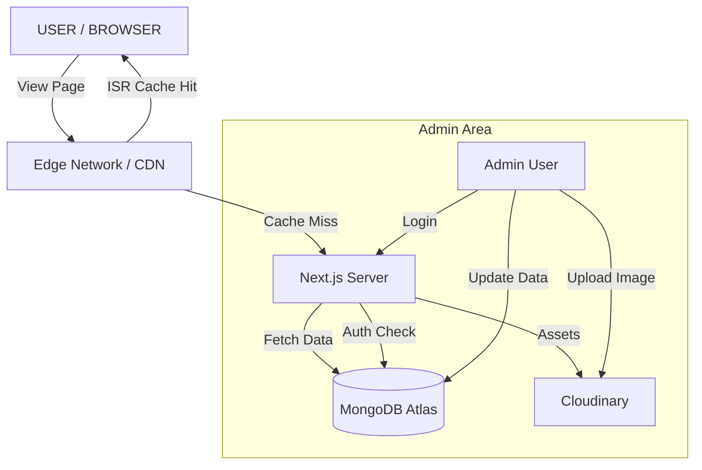
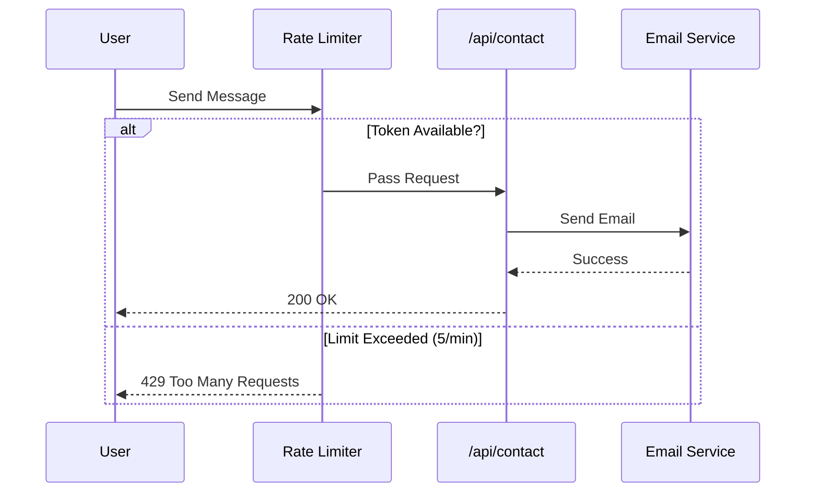

# 🚀 Ultimate Next.js Portfolio - High Performance & Secure

  

A premium, high-performance portfolio website built with **Next.js 15**, **React 19**, and **Tailwind CSS v4**. Featuring a glassmorphism design, a powerful Admin Dashboard, sophisticated security measures, and blazing fast interactions powered by ISR.

---

## 🌟 Key Features

### 🎨 Frontend (Public)

- **Premium Glassmorphism Design:** Modern UI with blurred backdrops and neon accents.
- **Performance First:** Uses **Incremental Static Regeneration (ISR)** to serve cached pages instantly while updating every 60s.
- **Interactive Animations:** Powered by `framer-motion`, `react-parallax-tilt`, and custom particle effects.
- **Smart Filtering:** Filter projects by "Static / Interactive" or "Live Demo" with a smooth tab interface.
- **Optimization:** `next/image` for LCP optimization and code splitting for faster hydration.

### 🛡️ Backend & Security (Admin)

- **Secure Admin Panel:** Protected via `next-auth` sessions.
- **Rate Limiting:** Custom **Token Bucket** algorithm limits Contact Form spam (5 req/min).
- **Hardened Headers:** HSTS, X-Frame-Options, and Content Security Policies active.
- **Dynamic Content:** Full CRUD for Bio, Skills, Experience, Education, and Projects.
- **Hybrid Inputs:** Smart categorization system (Type or Select) for projects.
- **Cloudinary Integration:** Seamless image uploads for profile and project screenshots.

---

## 🛠️ Tech Stack

| Category       | Technologies                                        |
| -------------- | --------------------------------------------------- |
| **Core**       | Next.js 15, React 19, Javascript (ES6+)             |
| **Styling**    | Tailwind CSS v4, Styled-Components                  |
| **Database**   | MongoDB (Mongoose)                                  |
| **Auth**       | Next-Auth v4 (Credentials)                          |
| **Animations** | Framer Motion, React-Typewriter, Parallax Tilt      |
| **Tools**      | Cloudinary, Resend/Nodemailer, React Hook Form, Zod |

---

## 📊 System Architecture

### 1. High-Level Architecture

This diagram illustrates how the Next.js App Router connects disparate services (DB, Auth, Storage).



### 2. Contact Form Flow (Security)

Visualizing the Rate Limiting protection.



---

## 🚀 Getting Started

### Prerequisites

- Node.js 18+
- pnpm (recommended) or npm
- MongoDB URI
- Cloudinary Credentials

### Installation

1.  **Clone the Repository**

    ```bash
    git clone https://github.com/yourusername/portfolio-nextjs.git
    cd portfolio-nextjs
    ```

2.  **Install Dependencies**

    ```bash
    pnpm install
    ```

3.  **Environment Setup**
    Create a `.env.local` file:

    ```env
    # Database
    MONGODB_URI=mongodb+srv://...

    # Auth
    NEXTAUTH_URL=http://localhost:3000
    NEXTAUTH_SECRET=your_super_secret_key

    # Cloudinary
    NEXT_PUBLIC_CLOUDINARY_CLOUD_NAME=...
    CLOUDINARY_API_KEY=...
    CLOUDINARY_API_SECRET=...

    # Email
    EMAIL_SERVER_USER=...
    EMAIL_SERVER_PASSWORD=...
    EMAIL_FROM=...
    ```

4.  **Run Development Server**
    ```bash
    pnpm run dev
    ```

---

## 📂 Project Structure

```bash
├── app/
│   ├── admin/          # Protected Admin Routes
│   ├── api/            # Backend API Endpoints (Auth, Bio, Projects...)
│   ├── globals.css     # Tailwind v4 & Global Styles
│   ├── layout.jsx      # Root Layout (SEO, Fonts)
│   └── page.jsx        # Homepage (ISR Enabled)
├── components/
│   ├── admin/          # Sidebar, Header, Login Forms
│   ├── cards/          # ProjectCard, ExperienceCard
│   └── sections/       # Hero, Skills, Contact
├── lib/
│   ├── db/             # Mongoose Models
│   ├── limiter.js      # Rate Limiting Logic
│   └── utils/          # Helpers & Animations
└── public/             # Static Assets
```

---

## 🔒 Security Measures

1.  **Strict Content Security Policy (CSP):** Prevents XSS attacks.
2.  **Rate Limiting:** In-memory tracking of IP addresses to block abuse.
3.  **Role-Based Access Control:** Admin routes are middleware-protected.
4.  **Input Validation:** All forms use `Zod` schemas for server-side validation.

---

## ⚡ Performance Optimizations

- **ISR (Incremental Static Regeneration):** Homepage revalidates every 60 seconds (`revalidate: 60`).
- **Tree Shaking:** `lucide-react` and `react-icons` optimized in `next.config.mjs`.
- **Lazy Loading:** Components and images load only when in viewport.
- **Font Optimization:** Google Fonts loaded via `next/font` with `swap` strategy.

---

## 📝 License

This project is open-source and available under the [MIT License](LICENSE).
